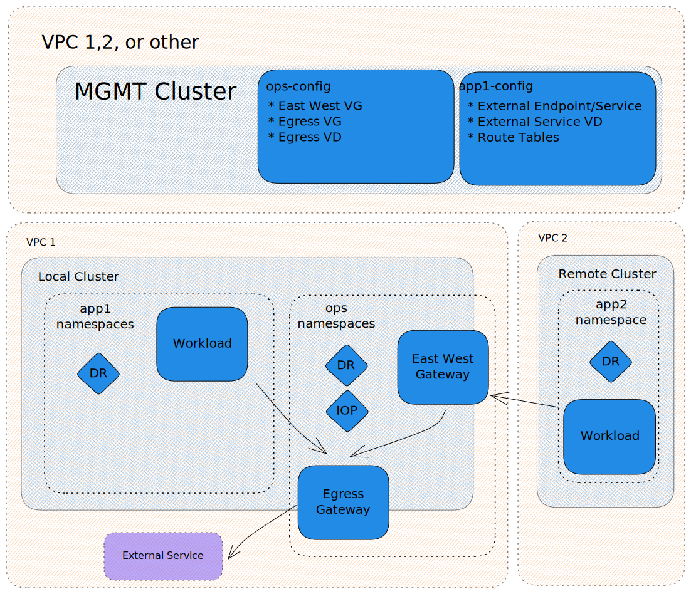

# Gloo Mesh And Istio Egress Gateway Functionality

# Motivation

In this example, two clusters exist in separate networking regions but need access to the same service with a set of certificate information. In order to access this service from the remote cluster, traffic must be intercepted, sent through the east/west gateway and leave through the egress gateway. Ideally mTLS will be maintained throughout the entire journey as well.

# Example Architecture

# Setup

- Gloo Mesh 2.2.4
- Istio 1.16
- Workspace selecting all namespaces across all clusters
- Workspace settings with federation and service isolation disabled
- Root Trust Policy for clusters

# Resources

- MGMT
  - external-endpoint.yaml
  - external-service.yaml
  - external-service-virtual-destination.yaml
  - egress-gateway-virtual-destination.yaml
  - egress-gateway-virtual-gateway.yaml
  - east-west-gateway-virtual-gateway.yaml
  - route-table-from-mesh-to-egress.yaml
  - route-table-from-egress-to-egress.yaml
  - route-table-from-egress-to-external-service.yaml
- Local
  - egress-istio-operator.yaml
  - destination-rule-source-namespace.yaml
  - destination-rule-gateway-namespace.yaml
- Remote
  - destination-rule-source-namespace.yaml

# Notes

- External Endpoint is required here to allow for the creation of a Virtual Destination (usually not needed)
- Virtual Destinations *must* have the clientMode specified as tlsTermination
- The virtual gateways are using selectors on istio gateways that are automatically created. (there is no corresponding IOP)
- East West gateways have an additional port 443, for tlsTermination
- The SNI field on destination rules does limit the defined path per resource. (one gateway per SNI)
- mTLS was not set up in the above example, but should be configurable with destinationrules. [link](https://istio.io/latest/docs/tasks/traffic-management/egress/egress-tls-origination/#configure-mutual-tls-origination-for-egress-traffic-at-sidecar)
